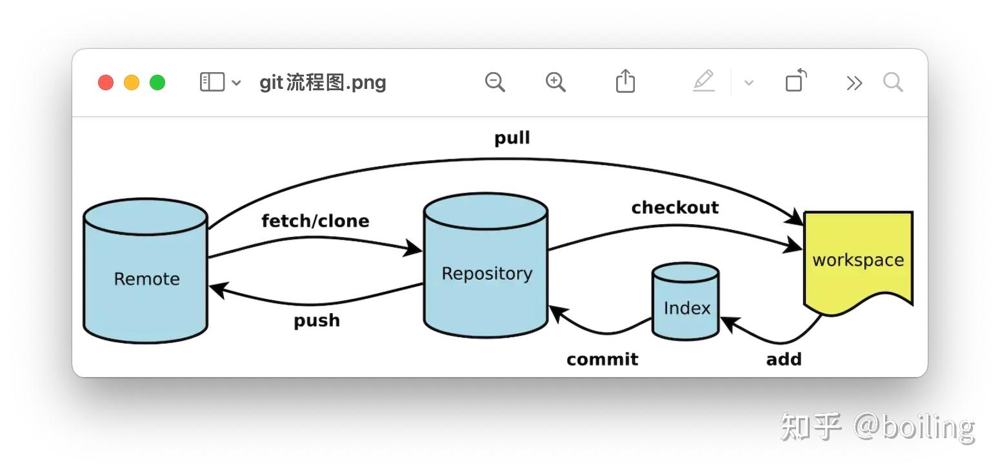

##

### Use Hadoop and Spark

**UI**
HDFS UI → http://localhost:9870

YARN UI → http://localhost:8088


**HDFS (NameNode UI alternative)**

| Function        | Web UI Port | CLI Equivalent            |
| --------------- | ----------- | ------------------------- |
| NameNode status | 9870        | `hdfs dfsadmin -report`   |
| DataNode list   | 9870        | `hdfs dfsadmin -report`   |
| ResourceManager | 8088        | `yarn application -list`  |
| NodeManager     | 8042        | `yarn node -list`         |
| JobHistory      | 19888       | `mapred job -list`        |
| Logs            | –           | `cat $HADOOP_HOME/logs/*` |


```bash
hdfs dfsadmin -report
```
*"Cluster Overview"*
shows DataNode health, usage , capacity.

```bash
hdfs dfs -ls /
hdfs dfs -du -h /
```
Lists directories and disk usage inside HDFS.

**YARN ResourceManager UI alternative**

```bash
yarn application -list
```
List running application

```bash
yarn application -status <application_id>
```
Get details for a specific app

```bash
yarn node -list -all
```
View cluster node status

```bash
yarn logs -applicationId <application_id>
```

**Job History & Logs**

```bash
mapred job -list
mapred job -status <job_id>
```
View job history in text.

```bash
cat $HADOOP_HOME/logs/*
```
Check logs directly.


### Appendices
1. **This lab is managed by git, to push my lab onto the remote repos.**

so I find it necessary to know sth about git. Here are the basic usage of git:

**Git Commands**

```bash
git init
git remote add/remove
git add
git commit
git puh

git branch <-d <{branch_name}
git checkout {branch_name}
# ...
```

 < means choose or not; {} means it is a var. 

then , How git runs?

**GIt Principles**



**2. Hadoop & Spark**

- **What is the Hadoop doing?**

> 三冬四夏：

你和团队做了一款短视频App，结果一夜爆火 ，用户量噌噌往上涨，很快就跟抖音快手肩并肩了。每天，用户们的点赞 、评论 、分享 、观看 行为如潮水般涌入你的服务器，产生了PB级别的海量日志数据。

有一天，老板把你叫到办公室，眉飞色舞地提出两个“小需求”：

- “我们要做一个‘全国热门视频实时热力图’，要能在大屏幕上看到哪个城市的网友正在刷哪个视频，要实时的，延迟不能超过一秒！”
- “有用户投诉，说我们老给他推荐一些他不感兴趣的土味视频。你能不能做一个工具，可以追溯我们给任何一个用户的每一次视频推荐，到底是基于他之前的哪个行为（比如点赞、关注、搜索）？我要看到完整的归因链路！”

你听完，表面上：“老板牛逼！这个功能绝对炸裂！”你心里想：“完了，芭比 Q 了。”

第一个需求是海量数据的高实时流计算,  第二个需求是超大规模数据的深度挖掘和血缘追溯。这俩事，用你项目里那套 Java + SpringBoot + MySQL 的技术栈，别说做了，想都不敢想。从几百亿条日志里给一个用户做行为归因？你的 MySQL 数据库怕是要当场飞升。

怎么办？难道要跟老板说“臣妾做不到”？

不，作为一名优秀的工程师，我们的字典里没有“不行”二字。是时候请出传说中的大数据处理核武器——Hadoop 全家桶和它的伙伴们了。

大数据的核心思想：一个字，“切”！面对处理不过来的海量数据，无论是存储还是计算，最简单、最暴力的思想就一个字："切"！一台机器干不完的活，就切开让一百台、一千台机器一起干。这个朴素而强大的思想，正是整个大数据技术栈的基石。围绕这个"切"字，Hadoop 要解决两大核心难题：怎么存和怎么算。
问题一：怎么存？(HDFS - 无限容量的数据宝库)

TB 级别的用户日志和视频数据，单台服务器的硬盘连个零头都装不下。怎么办？
adoop 的存储组件 HDFS (Hadoop Distributed File System) 说：交给我。
- 切块 (Block)：HDFS 会把任何上传的巨大文件，自动切成固定大小的“数据块”（Block），比如每块 128MB。一个 1TB 的日志文件，就被切成了几千个小块。
- 分发 (Distribute)：HDFS 会把这些数据块像发扑克牌一样，分发到集群里成百上千台普通的服务器上（这些服务器叫 DataNode）。
- 备份 (Replicate)：为了防止某台服务器宕机导致数据丢失，HDFS 会自动为每个数据块创建多个副本（默认 3 个），并把它们存放在不同的机器上。

有了 HDFS，你就拥有了一个理论上无限容量、还自带容灾备份的超级数据金库。你只管往里扔数据，完全不用关心数据具体藏在了哪台机器上，HDFS 会帮你搞定一切。我们的短视频 App 产生的所有用户行为日志，都可以安心地存放进 HDFS 这个巨大的"数据宝库"里。

**问题二：怎么算？(MapReduce - 庞大的调查兵团)**
存储解决了，现在来解决老板那个变态的“推荐归因”需求。要从海量日志中，找出某个用户（比如 User_A）被推荐某个视频（Video_B）的根本原因，我们需要像侦探一样，把 User_A 的所有历史行为（点赞、关注、搜索、观看时长等）全部翻出来，然后进行分析。这个计算量是恐怖的。
这时，Hadoop 的计算框架 MapReduce 就该登场了。你可以把它想象成一个庞大的调查兵团。
- Map (分头调查)：你下达调查指令。总指挥部（MapReduce 框架）会将这个指令**分解，派遣**成千上万个“调查员”（Map Task）。每个调查员负责一小片“案发现场”（一小块数据），他们的任务很简单：从自己负责的日志里，找出所有和 User_A 相关的“线索”，并打上标签。例如 ：
`(User_A, 『点赞了舞蹈视频_123』)`
`(User_A, 『完整观看了科技视频_456』)`
- Reduce (汇总分析)：当所有调查员都完成任务后，会有一位或多位“首席分析师”（Reduce Task）登场。他们负责把所有调查员从四面八方收集来的、关于 User_A 的线索全部汇总到一起，然后按照时间线和逻辑关系进行梳理，最终形成一份完整的“调查报告”：“之所以给 User_A 推荐 Video_B，是因为他曾点赞过 3 个同类视频，并关注了该视频的作者。”

通过这种“分头调查，统一汇总”的模式，MapReduce 就能并行处理海量数据，完成看似不可能的计算任务。

问题三：兵团怎么管？(YARN - 中央调度中心)
成千上万的“调查员”和“分析师”（计算任务），都需要服务器的 CPU 和内存资源才能干活。谁来给他们分配资源？谁来管理他们的死活？总不能我们手动去调度吧？当然是再加一层！这个调度层就是 YARN (Yet Another Resource Negotiator)。YARN 是整个 Hadoop 集群的资源调度中枢，是调查兵团的“中央调度中心”。

它统一管理着集群里所有服务器的计算资源，并把这些资源打包成一个个的“容器” (Container)，你可以理解为一个个标准的工作位（包含 CPU 和内存）。当 MapReduce 这个“调查兵团”接到任务时，会先向 YARN 这个“调度中心”申请：“我需要 800 个调查员和 50 个分析师的工作位！”YARN 根据当前资源的空闲情况，在各个服务器上分配出足够的 Container，然后 MapReduce 再把具体的计算任务派发到这些 Container 里去执行。有了 YARN，整个集群的资源得到了高效、合理的利用。至此，Hadoop 三剑客聚齐了：HDFS 管存，MapReduce 管算，YARN 管调度。我们已经有能力解决老板的第二个难题了。

进化一：我不想写代码，只想说人话！(Hive)写 MapReduce 代码太麻烦了！数据分析师们更习惯用 SQL。他们想查一下“上个月发布视频数量最多的 Top 100 网红”，难道也要等你先去写一堆 Java 代码吗？为了让大家能用更“人性化”的方式和大数据交互，Hive 出现了。Hive 就像是“调查兵团”里一位能听懂 SQL 的总指挥。分析师可以直接用类似 SQL 的语言 (HQL) 下达指令，比如 ：
进化一：我不想写代码，只想说人话！(Hive)写 MapReduce 代码太麻烦了！数据分析师们更习惯用 SQL。他们想查一下“上个月发布视频数量最多的 Top 100 网红”，难道也要等你先去写一堆 Java 代码吗？为了让大家能用更“人性化”的方式和大数据交互，Hive 出现了。Hive 就像是“调查兵团”里一位能听懂 SQL 的总指挥。分析师可以直接用类似 SQL 的语言 (HQL) 下达指令，比如 ：
``` sql
   SELECT author, COUNT(*) 
   FROM videos 
   GROUP BY author 
   ORDER BY COUNT(*) DESC 
   LIMIT 100
```

Hive 会自动把这条“人话”翻译成一套复杂的 MapReduce 执行计划，然后交给下面的兵团去执行。这极大地降低了大数据分析的门槛。

**进化二：要求更快、更实时！(Spark & Flink)**

老板的需求是不断进化的。

场景一：加速调查！

MapReduce 虽好，但有个毛病：每个调查员找到线索后，都要先把线索记录到硬盘（HDFS）上，下一步的分析师再从硬盘上读取，这一来一回的**磁盘读写，太慢**！

老板抱怨：“这个归因分析能不能 5 分钟出结果？现在要半小时！”

于是，Spark 来了。你可以把 Spark 理解为一支装备了“内存对讲机”的特种部队。他们传递线索（中间数据）时，直接通过高速的内存进行，只有在内存不够用时才借助硬盘。

这使得 Spark 的计算速度通常是 MapReduce 的几十甚至上百倍。

与 Hive 对应的，Spark 也有自己的 SQL 引擎 Spark SQL，性能更强。

场景二：实时热力图！

老板的第一个需求——“实时热力图”，用 Spark 这种批处理（Batch）框架还是有延迟。它最快也只能做到“准实时”（比如每 5 秒统计一次）。老板要的是“真·实时”！

于是，Flink 来了。Flink 是一支专注于“现场直播”的流计算部队。它不像 Spark 那样需要“攒一波再处理”，而是数据流过来一条，就处理一条。

北京一个用户点了个赞，这个事件流过 Flink，热力图上北京的热度值就“+1”，延迟是毫秒级的。这才是老板想要的实时效果。

进化三：在线毫秒级查询！(HBase)

现在，分析和计算的问题都解决了。但又有一个新场景：当一个用户打开 App 时，我们需要在 50 毫秒内，从他关注的上千个网红发布的数万个视频中，查询出他还没看过的最新视频。

这个场景的特点是：数据总量巨大，但每次只查询一小部分（某个用户的），且对响应时间要求极高。

用 Hive/Spark 去查？分钟级的延迟，用户早把 App 卸了。

这时候，就需要一个专门用于海量数据在线随机读写的数据库了，它就是 HBase。

HBase 建立在 HDFS 之上，你可以把它看作是一个巨大无比、但查询速度又飞快的分布式 Key-Value 数据库。

它非常适合存储用户画像、关注列表、消息索引这类需要在海量数据中进行快速定位查询的场景。

总结：一个短视频 App 的大数据架构现在，我们把这些工具串起来，看看它们是如何协同工作的：

- 数据流入：用户的点赞、观看等行为日志，一部分实时发送到像 Kafka 这样的消息队列，另一部分被归档存入 HDFS。
- 实时计算 (Flink)：Flink 消费消息队列中的实时数据流，用于计算“实时热门视频热力图”这类指标。
- 在线查询 (HBase)：用户的个人资料、关注列表等信息存储在 HBase 中，供 App 在线业务进行毫秒级快速查询。
- 离线分析 (Spark/Hive)：每天凌晨，启动一个 Spark 任务，对 HDFS 中存储的全量日志进行深度计算和分析，完成如“推荐归因分析”、“网红收入计算”等复杂任务。所有这些任务的资源，都由 YARN 统一调度。

从一个看似不可能完成的任务开始，我们借助 Hadoop 和它的伙伴们，最终完美地解决了老板提出的所有难题。

> 作者：Cv大法代码酱
链接：https://www.zhihu.com/question/333417513/answer/1955027226073465899
来源：知乎
著作权归作者所有。商业转载请联系作者获得授权，非商业转载请注明出处。

Hadoop : in  cheap computers to compute and store.

在Hadoop出来之前，我们要处理数据，思路很直接：数据量大了，我买个更好的服务器。内存不够了？加内存条。硬盘不够了？上更大的硬盘阵列。CPU跑不动了？换更牛的CPU。这叫纵向扩展 (Scale-up)。

我刚入行那会儿，给某电商做商品关联推荐。当时用户行为日志一天下来也就几十个G，我们用一台很不错的Dell服务器，写个Python脚本，吭哧吭哧跑一晚上，第二天早上能出结果。后来业务一上量，日志一天几个T。那台服务器直接就爆了，内存读不进去，硬盘IO直接打满。当时老板问我咋办，我说加机器。他以为是再买一台更牛的。我说不，是买一堆最普通的PC服务器。

这就是Hadoop的思路：横向扩展 (Scale-out)。

2 Probs:

这么多数据，怎么存到一千台机器上？还得保证别丢了。 你不能手动拷吧？某台机器硬盘坏了，它上面的数据是不是就没了？

数据是分开了，那计算任务怎么分发下去，又能把结果汇总起来？ 你总不能登录到一千台机器上，每台都跑一遍脚本，再手动把结果合并吧？

Hadoop就是为了解决这两个核心问题而生的。

...

API:Hadoop不仅仅是一个API规范，它是一个包含了规范、实现和运行环境的完整框架（Framework）。

你在编写MapReduce代码时，确实需要遵循它的API来写你的`Mapper & Reducer`

这部分可以说是规范。但Hadoop还为你提供了：

**运行环境**：它有自己的守护进程（NameNode, DataNode, ResourceManager, NodeManager等），负责整个集群的资源调度、任务监控、故障恢复。你把写好的代码（通常是打成一个jar包）提交给集群，它负责帮你把程序分发到上百台机器上，然后调度执行，你不用关心底层这些复杂的细节。

一套生态系统：围绕Hadoop核心，发展出了一大堆子项目，比如：Spark , Hive , HBase

MapReduce is based on hard disk, and it is too slow. So:

Spark is putting calc in the memory. It is a frame of calculating.


---
Little Notes:
- build image->run_containers based on image ->stop_containers
In the process, build image write configures;

run_containers do creating virtual machines with names and net and capabilities different.

stop_containers do deleting virtual machines.


